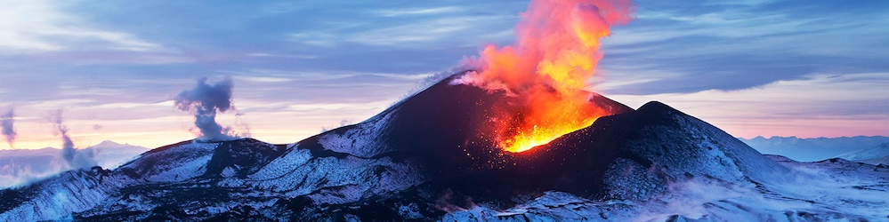

# 🌋 Magmatic Cristallisation - Modélisation Géologique


---



---

## Sommaire
- [Description](#description)
- [Fonctionnalités](#fonctionnalités)
- [Installation](#installation)
- [Utilisation](#utilisation)
- [Exemple de résultat](#exemple-de-résultat)
- [Technologies utilisées](#technologies-utilisées)
- [Contact](#contact)

---

## Description

Modèle de cristallisation fractionnée des magmas basé sur la série de Bowen. Ce projet simule l’évolution de la composition des magmas lors du refroidissement, en tenant compte de la cristallisation séquentielle des minéraux selon la série discontinue et continue de Bowen.
Il permet d’observer l’évolution chimique du magma résiduel au cours du refroidissement et de visualiser graphiquement cette évolution.

---

## Fonctionnalités

- Définition de minéraux avec plages de températures de cristallisation et compositions chimiques.
- Modélisation de la cristallisation progressive selon la température décroissante.
- Calcul des masses cristallisées à chaque étape.
- Visualisation graphique de la composition chimique résiduelle en fonction de la température.
- Sauvegarde automatique du graphique dans un dossier `img`.

---

## Installation

1. Clonez ce dépôt :
   ```bash
   git clone https://github.com/ton-utilisateur/cristallisation-fractionnee.git
   cd cristallisation-fractionnee
